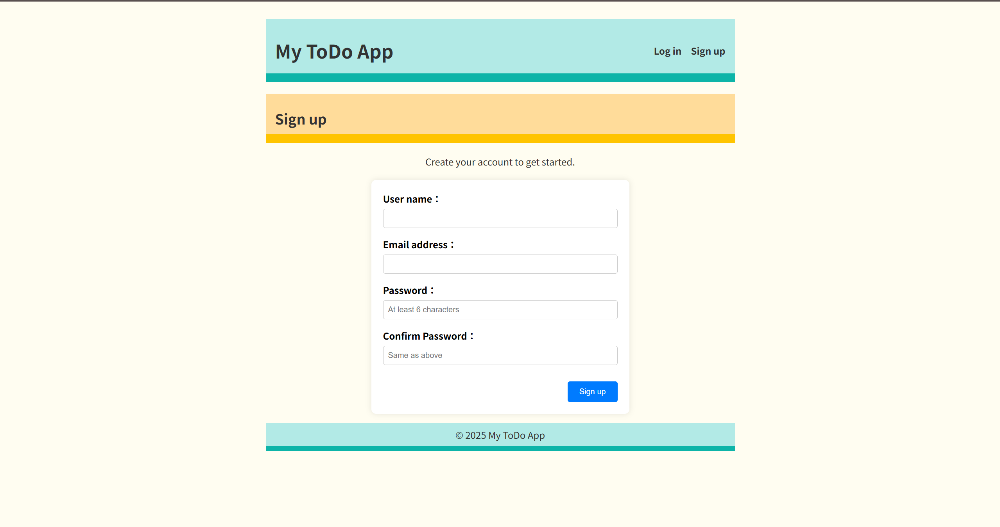
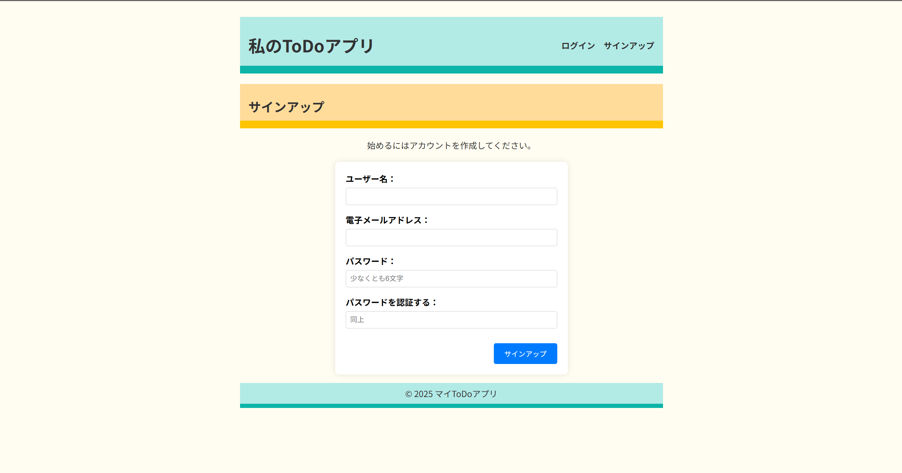
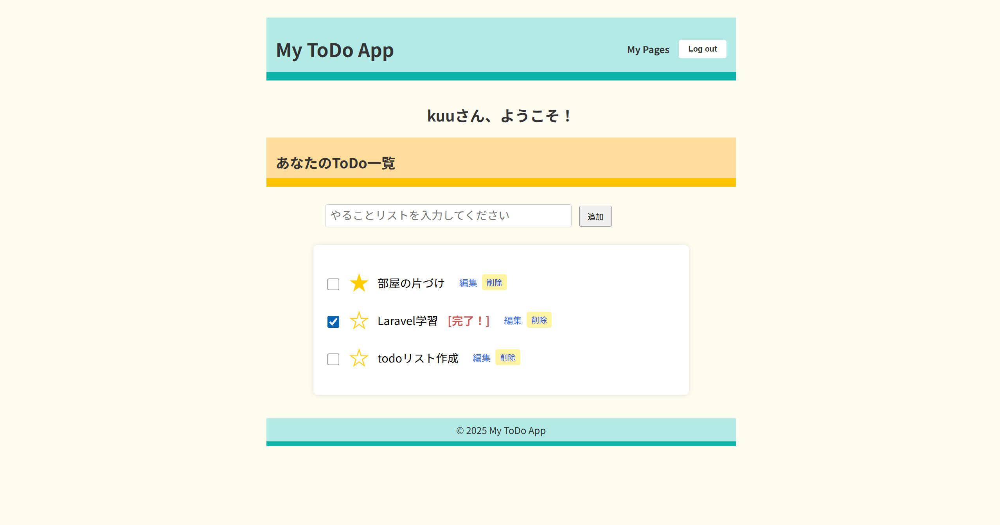

# Laravel ToDo アプリ

ログイン機能付きのシンプルなToDo管理アプリです。
Docker + Laravel Sailを使って開発環境を構築しています。
課題練習のため基本的な機能のみとなっていますが、
日常的に使う想定で作りました。

## 主な機能

- ユーザー登録／ログイン／ログアウト
- ToDoの追加／編集／削除
- 完了チェック機能
- 重要タスクのスターマーク機能
- 承認されたユーザーのみが自分のToDoを操作可能

## 使用技術

- PHP 8.x
- Laravel 10
- MySQL
- Docker / Laravel Sail

## セットアップ手順

```bash
git clone https://github.com/kumika-morimoto/Laravel-practice-todo-app2.git
cd laravel-practice-todo-app2
cp .env.example .env
./vendor/bin/sail up -d
./vendor/bin/sail artisan migrate
```

## スクリーンショット

### サインアップ画面

ユーザー登録機能を実装しており、ログインして自分専用のToDoを管理できます




### ログイン後のToDo一覧

タスクの追加・編集・削除、完了チェック、重要タスクのスター機能を備えてます

